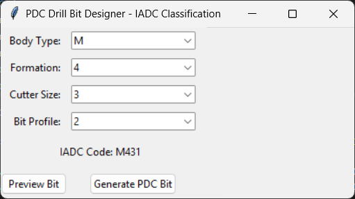
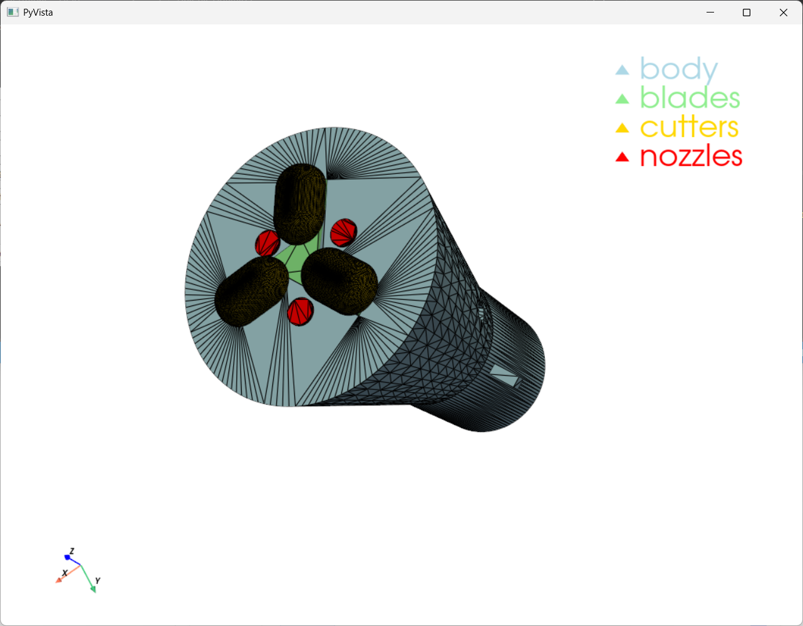

# Drill‑Bit Optimizer: Physics‑Informed PDC Bit Design

[](LICENSE)
[](https://www.python.org/downloads/)
[](https://www.tensorflow.org/)

## Overview

**Drill‑Bit Optimizer** is an open‑source, physics‑informed design tool for **PDC (Polycrystalline Diamond Compact) drill bits**. It combines a **Physics‑Informed Neural Network (PINN)** with the **IADC Fixed Cutter Classification System** to generate optimised 3D CAD models of PDC bits.

The tool automates the entire workflow from:

- **Material and geological parameters** (via IADC code)
- **PINN‑predicted wear rate**
- **Parametric 3D CAD generation** (body, blades, cutters, nozzles, gauge pads, junk slots)
- **Interactive visualisation** (PyVista)
- **Export to STL** for manufacturing or FEA.

## Features

- **IADC‑driven design** – decode a 4‑character IADC code (e.g., `M431`) into body material, formation hardness, cutter size, and profile.
- **Physics‑Informed Neural Network** – predicts tool wear rate from metallurgical and geological data, with physical constraints (hardness–tensile relationship, fracture toughness).
- **Parametric CAD generation** – uses `cq_gears` and CadQuery to build realistic PDC bits with:
  - Matrix/steel body with tapered profile
  - Three spiral‑like blades
  - Domed PDC cutters
  - Central and side flushing nozzles
  - Segmented gauge pads
  - Profile‑dependent junk slots
- **Multiple interfaces** – command‑line, interactive CLI, tkinter GUI, and Streamlit web app.
- **Export** – surface STL mesh for 3D printing or FEA.

## Installation

```bash
# Clone the repository
git clone https://github.com/altugrakay-commits/Drill-Bit-Optimizer.git
cd Drill-Bit-Optimizer

# Create and activate a virtual environment (recommended)
python -m venv venv
source venv/bin/activate      # On Windows: venv\Scripts\activate

# Install dependencies
pip install -r requirements.txt

# (Optional) Install cq_gears for better gear profiles
pip install git+https://github.com/meadiode/cq_gears.git@main
```

# Usage

## Command-Line Interface (CLI)

```
# Generate a bit with a given IADC code and export STL
python main.py --iadc M431 --fea

# Launch the tkinter GUI
python main.py --gui

# Interactive IADC code entry
python cli.py --interactive
```

## Streamlit Web App

```
streamlit run streamlit_app.py
```

Then open your browser at `http://localhost:8501`.

## IADC Code Explained


The IADC Fixed Cutter Classification system uses a 4‑character code:

| Position             | Meaning             | Options
| -------------------- | ------------------- | ------------------------------------------------------ |
| **1** (Letter) | Body Material       | `M` = Matrix, `S` = Steel, `D` = Diamond‑Enhanced
| **2** (Digit)  | Formation Hardness  | `1`–`7` (Very Soft to Extremely Hard)
| **3** (Digit)  | Cutter Size/Density | `1` = 19mm, `2` = 16mm, `3` = 13mm, `4` = 8mm
| **4** (Digit)  | Bit Profile         | `1` = Short Fishtail, `2` = Short, `3` = Medium, `4` = Long

The tool maps these digits to specific CAD parameters (e.g., slot width, depth, cutter count, body taper).

# Screenshots
\
**Figure 1:** tkinter GUI with IADC dropdowns and code display.

\
**Figure 2:** PyVista visualisation of a generated PDC bit (body, blades, cutters, nozzles).

# Project Structure

```text
Drill-Bit-Optimizer/
├── Data/                     		# Synthetic or user data
├── Models/                   		# Trained PINN weights
├── Output/                   		# Generated STL files and reports
├── cad_generator.py          		# PDC bit CAD generation
├── cli.py					              # Interactive CLI
├── config.py                 		# Paths, constants, feature lists
├── data.py                   		# Data loading and preprocessing
├── gui.py                    		# tkinter GUI
├── iadc_mapper.py            		# IADC code tables and decoder
├── main.py                   		# CLI entry point
├── pinn_model.py             		# PINN architecture, physics layers
├── streamlit_app.py          		# Streamlit web app
├── visualization.py          		# Mesh conversion and PyVista rendering
├── requirements.txt          		# Python dependencies
├── README.md                 		# This file
└── TECHNICAL_BRIEF.md        	  # Detailed methodology
```
# License

Distributed under MIT License. See `LICENSE` for more information.

# Acknowledgements

* `cq_gears` for involute gear generation.
* CadQuery and PyVista communities for open‑source CAD and visualisation.
* TensorFlow for the deep learning framework.
